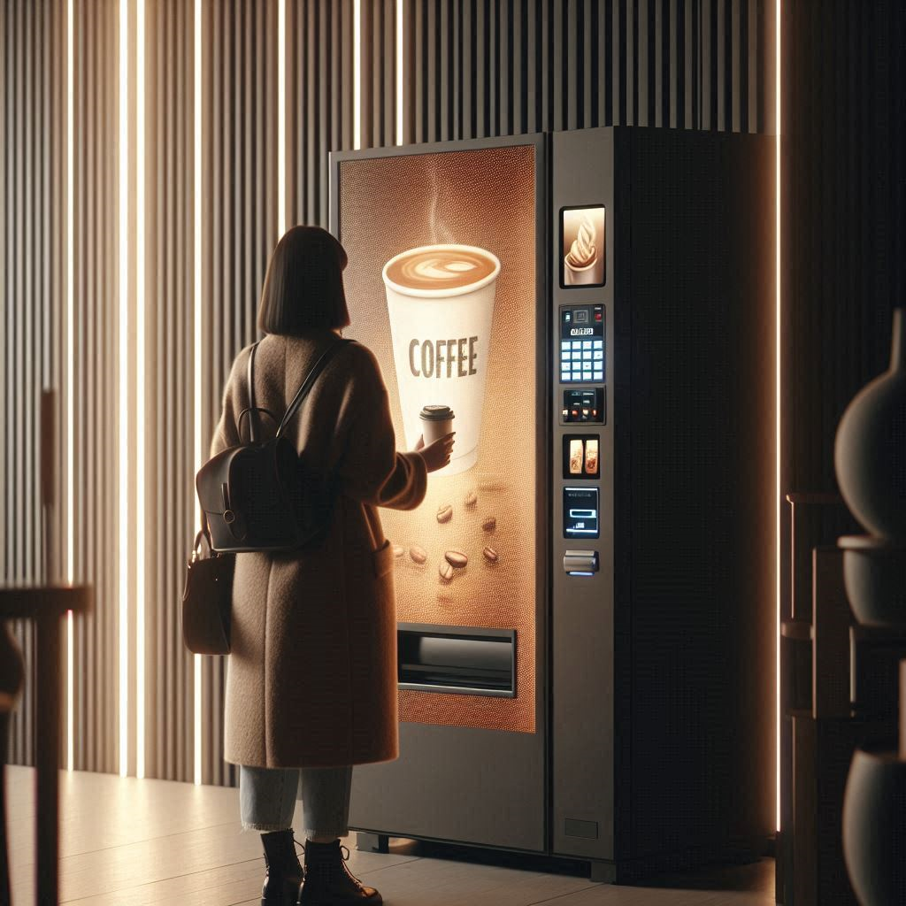
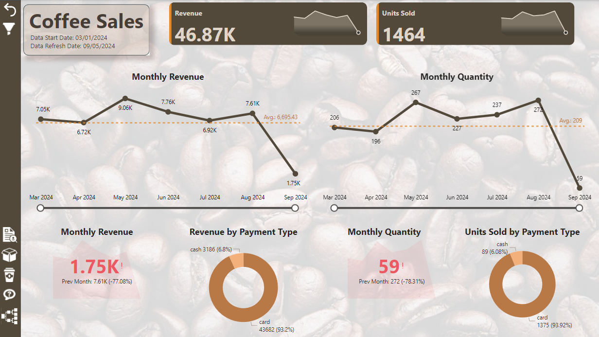
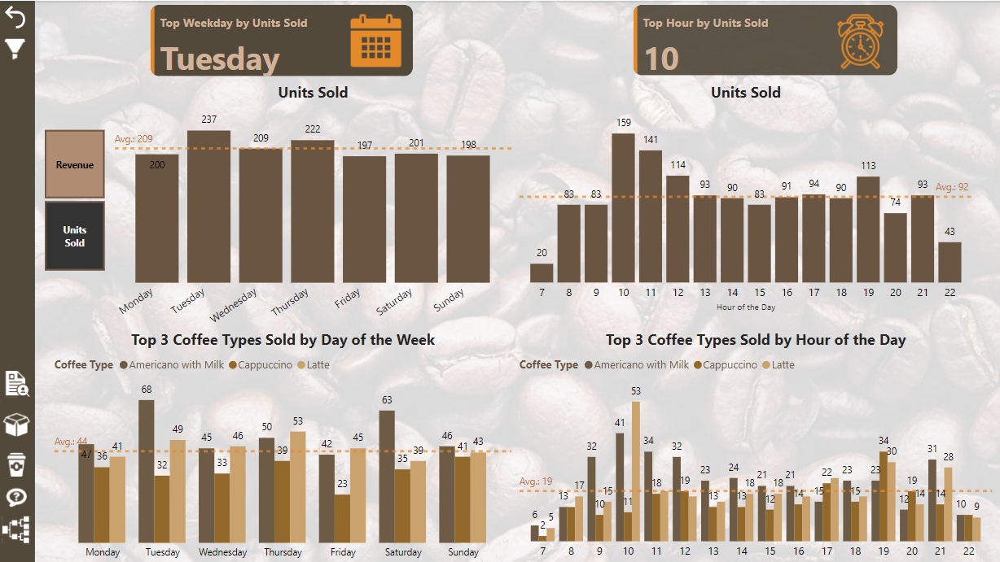
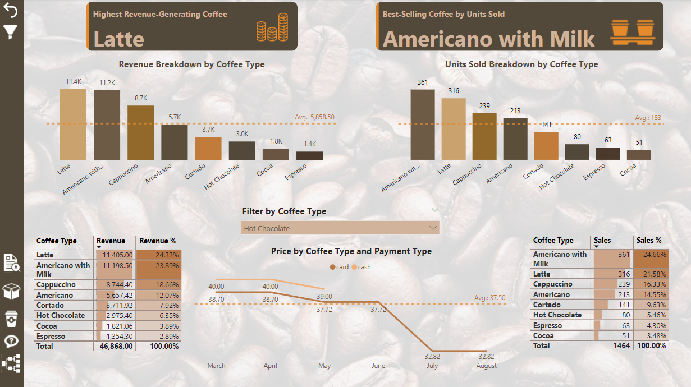

# Coffee Sales Dashboard

## Overview
This project showcases an interactive and visually engaging dashboard for analyzing coffee sales data collected from a vending machine. The dataset, provided as part of an open data initiative on [Kaggle](https://www.kaggle.com/datasets/ihelon/coffee-sales/data), offers insights into revenue, unit sales, and sales trends categorized by factors such as payment type, weekday, hour, and coffee type. The main objective is to uncover purchasing patterns and customer preferences, providing actionable insights to optimize sales strategies and enhance customer satisfaction.
 
## Key Features

### **1. Dashboard Overview**
- **Revenue and Units Sold Overview:** Displays total revenue (`46.87K`) and total units sold (`1,464`) with historical trends.
- **Monthly Revenue and Quantity Trends:** Interactive line charts highlighting monthly performance.
- **Revenue and Quantity by Payment Type:** Breakdown of sales data by payment method (cash and card).

### **2. Weekday and Hourly Analysis**
- **Top Weekday by Units Sold:** Identifies `Tuesday` as the best-performing day with an average of `237` units sold.
- **Top Hour by Units Sold:** Pinpoints `10 AM` as the busiest sales hour, with `159` units sold.
- **Top 3 Coffee Types by Day of the Week:** Highlights the most popular coffee types (`Americano with Milk`, `Cappuccino`, and `Latte`) on each weekday.
- **Top 3 Coffee Types by Hour of the Day:** Detailed analysis of sales patterns for the most popular coffee types across the day.

### **3. Coffee Type Analysis**
- **Highest Revenue-Generating Coffee:** `Latte` leads with `24.33%` of total revenue.
- **Best-Selling Coffee by Units Sold:** `Americano with Milk` accounts for `24.66%` of total sales.
- **Revenue and Units Sold Breakdown by Coffee Type:** Visual and tabular representation of performance for all coffee types.
- **Price by Coffee Type and Payment Type:** Comparison of prices by payment method.

## Data Insights
- **Revenue Trends:** Revenue peaked in May 2024 (`9.06K`) and dropped significantly in September 2024 (`1.75K`). The significant drop in September is due to data being collected for only part of the month.
- **Sales Trends:** Units sold show similar trends, with significant dips during off-peak months.
- **Payment Preferences:** The majority of transactions were made using cards (`93.2%` of revenue).
- **Popular Coffee Types:** `Latte` is the highest revenue generator, while `Americano with Milk` is the most frequently purchased.
- **Customer Behavior:** Sales peak on weekdays (`Tuesday`) and during morning hours (`10 AM`).

## Technical Details
The dashboard is created using:
- **Power BI:** For data visualization and dashboard design.
- **Data Sources:** Coffee sales dataset with fields such as revenue, units sold, payment type, date, time, and coffee type.

## Conclusion
This dashboard serves as a powerful tool for analyzing coffee sales trends, understanding customer preferences, and making data-driven decisions to optimize sales strategies. The insights can help businesses maximize revenue and improve operational efficiency.

## Screenshots
### Dashboard Overview

### Weekday and Hourly Analysis

### Coffee Type Analysis

---
For any inquiries or collaboration opportunities, please feel free to contact me via [LinkedIn](https://linkedin.com/in/viktoriia-shalaieva) or [email](mailto:viktoriia.shalaieva@gmail.com).
